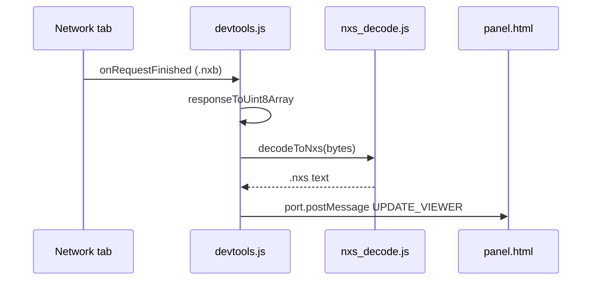

# Nyxis Inspector — DevTools Extension

Chrome / Firefox extension that registers a **Nyxis** sidebar in Developer Tools. When the Network tab loads a `.nxb` response (NYXB magic `0x4E595842`), it decodes the payload to human-readable **`.nxs`-style** text using the MIT JavaScript driver — no server changes required.

## Install (unpacked)

1. Sync the bundled SDK (after changing `js/nxs.js` or `js/nxs_decode.js`):

   ```bash
   bash devtools-extension/sync-lib.sh
   ```

2. **Chrome:** `chrome://extensions` → Developer mode → **Load unpacked** → select this `devtools-extension/` folder.

3. **Firefox:** `about:debugging` → This Firefox → **Load Temporary Add-on** → `manifest.json`.

4. Open DevTools on any page → **Nyxis** tab. Fetch a `.nxb` URL (e.g. from [nyxis.io](https://www.nyxis.io) demo fixtures); the panel updates automatically.

## How it works



- **Method 1** (site): serve `.nxs` as `text/plain`, compile in-page via WASM.
- **Method 2** (this extension): keep `.nxb` on the wire; inspect decoded source in DevTools.

## Package a zip for release

```bash
bash devtools-extension/sync-lib.sh
cd devtools-extension && zip -r ../nyxis-inspector.zip . -x '*.git*'
```

Publish `nyxis-inspector.zip` on GitHub releases or link from [nyxis-drivers](https://github.com/nyxis-io/nyxis-drivers) README.

## API (same module as the extension)

```js
import { decodeToNxs, isNxbBuffer, NyxisJsSDK } from "../js/nxs_decode.js";

const text = decodeToNxs(await fetch("/path/file.nxb").then(r => r.arrayBuffer()));
```

## Permissions

No manifest permissions. DevTools access is declared via `devtools_page` only (there is no `devtools` permission in MV3). No host permissions and no page DOM access; decoding runs locally in the DevTools context.
