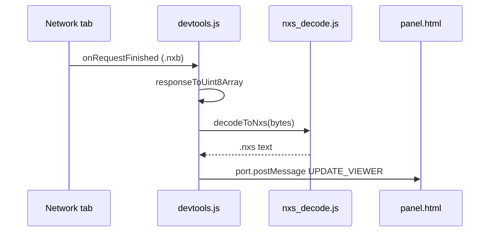

# Nyxis Inspector — DevTools Extension

Chrome / Firefox extension that registers a **Nyxis** sidebar in Developer Tools. When the Network tab loads a `.nxb` response (NYXB magic `0x4E595842`), it decodes the payload to human-readable **`.nxs`-style** text using the MIT JavaScript driver — no server changes required.

## Install (unpacked)

1. Sync the bundled SDK (after changing `js/nxs.js` or `js/nxs_decode.js`):

   ```bash
   bash devtools-extension/sync-lib.sh
   ```

2. **Chrome:** `chrome://extensions` → Developer mode → **Load unpacked** → select this `devtools-extension/` folder.

3. **Firefox:** `about:debugging` → This Firefox → **Load Temporary Add-on** → `manifest.json`.

4. Open DevTools on any page → **Nyxis** tab in the **top** toolbar (beside Console / Network — not a Network sidebar). Fetch a `.nxb` URL (e.g. `https://www.nyxis.io/bench/fixtures/records_1000.nxb`); the panel updates automatically.

### Troubleshooting

| Symptom | Fix |
|--------|-----|
| No **Nyxis** tab | Reload extension at `chrome://extensions`; close all DevTools windows and reopen. |
| Tab exists, empty / “bridge not ready” | Select **Nyxis** again after DevTools fully opens, or reload the extension. |
| Tab works, never decodes | DevTools must be **open before** the request. Use **Network** → reload page → pick a `.nxb` row. |
| Explorer loads `.nxs` only | That path compiles in-page; wire traffic is text. Load a `.nxb` fixture URL instead. |
| Stale decode after refresh | Fixed: panel clears on `devtools.network.onNavigated` when the inspected page reloads. |
| “Disconnected” / slow decode | MV3 service worker sleeps when idle; v1.0.3 adds heartbeat, auto-reconnect, and a “Fetching & decoding…” status while `getContent` + decode run. |
| Stuck on “Fetching & decoding” | Often an empty cached body: disable **Network → Disable cache** and hard-reload. Very large files may take time to decode and send to the panel. |
| `Extension context invalidated` | You reloaded the extension while DevTools was open. **Close DevTools completely**, then reopen (no reconnect loop will fix it). |

## How it works



- **Method 1** (site): serve `.nxs` as `text/plain`, compile in-page via WASM.
- **Method 2** (this extension): keep `.nxb` on the wire; inspect decoded source in DevTools.

## Package a zip for release

```bash
bash devtools-extension/sync-lib.sh
cd devtools-extension && zip -r ../nyxis-inspector.zip . -x '*.git*'
```

Publish `nyxis-inspector.zip` on GitHub releases or link from [nyxis-drivers](https://github.com/nyxis-io/nyxis-drivers) README.

## API (same module as the extension)

```js
import { decodeToNxs, isNxbBuffer, NyxisJsSDK } from "../js/nxs_decode.js";

const text = decodeToNxs(await fetch("/path/file.nxb").then(r => r.arrayBuffer()));
```

## Permissions

No manifest permissions. DevTools access is declared via `devtools_page` only (there is no `devtools` permission in MV3). No host permissions and no page DOM access; decoding runs locally in the DevTools context.
